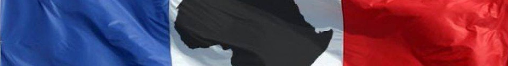

# Françoise Nicolas — Wiki

Plusieurs médias m’ont accolé l’étiquette suivante : « la lanceuse d'alerte qui accuse Nathalie Loiseau... » Ce Wiki porte sur le dévoiement la démocratie, mon affaire en constituant un angle privilégié.

## Structure
### [Sommaire](./pages/README.md)
* [Affaires](./pages/affaires.md)
* [Analyses](./pages/analyses.md)
* [Autre](./pages/autre.md)
* [Thèmes](./pages/themes.md)
* [Tribunes](./pages/tribunes.md)
* [Voir aussi](./pages/voiraussi.md)
### [Maintenance](./maintenance/README.md)
### [Pièces](./pieces/README.md)

## Mis en avant
### Affaire Françoise Nicolas
* Résumé [🇬🇧](./pages/en.md)[🇫🇷](./contenu/fr.md)
* [Dossiers](./pages/fn.md)

## Visiteurs
* [Contribuer au Wiki](./pages/contrib.md)
* [Faire un don](./pages/don.md)

