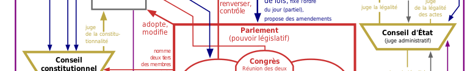

# Contrepouvoirs

## Parlement

### 2022 [Tribune dans Le Monde : pour un contrôle véritable des candidatures au Conseil constitutionnel](https://www.lemonde.fr/idees/article/2022/02/18/pour-un-controle-veritable-des-candidatures-au-conseil-constitutionnel_6114194_3232.html)

> Alors que les noms de Jacqueline Gourault, Véronique Malbec et François Seners viennent d’être proposés pour rejoindre l’institution, la juriste Elina Lemaire appelle le Parlement à vérifier les compétences juridiques et l’exemplarité des candidats.

### [Prolifération législative](proliferlegis.md)

> La multiplication des lois, sans chercher à s'assurer de leur efficacité, engendre un désordre législatif préjudiciable. (Badinter, 2007)

## Défenseur des Droit
### 2011 [Loi organique du 29 mars relative au défenseur des droits](https://www.legifrance.gouv.fr/loda/id/JORFTEXT000023781167/2022-02-16/)

### 2019 Sylvain Mouillard et Philippine Kauffmann pour Libé: [« Jacques Toubon: fin de mandat d'un défenseur des droits inespéreé »](https://www.liberation.fr/france/2020/06/30/jacques-toubon-fin-de-mandat-d-un-defenseur-inespere_1792944/)

---
Photo: [Institutions de la Vè](https://fr.wikipedia.org/wiki/Cinqui%C3%A8me_R%C3%A9publique_(France)#/media/Fichier:Schema_pouvoirs_Ve_republique_France-vec-final_form-ok.svg)
