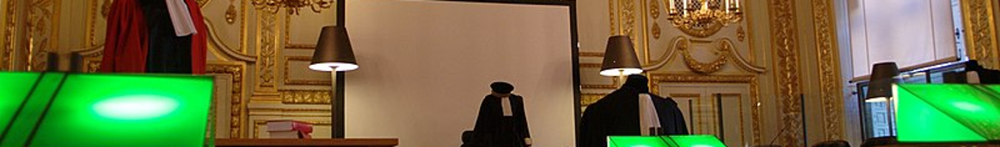

## Vie publique — par thème
### [Alternatives](democralter.md)
### [Capture de l'état](capturetat.md)
### [Contrepouvoirs](contrepouvoirs.md)
### [Corruption](corruption.md)
### [Déni de justice](denijust.md)
### [État policier](etat-policier.md)
### [International](internat.md)
### [Liberté d'expression](libertedexpr.md)
### [Quai d'Orsay, Françafrique](mae.md)
### [Robe noire](robenoire.md)

---
Photo: [Assises de la CA de Rennes](https://fr.wikipedia.org/wiki/Cour_d'assises_(France)#/media/Fichier:Parlement_de_Bretagne_-_Salle_des_Assises_1.jpg)
