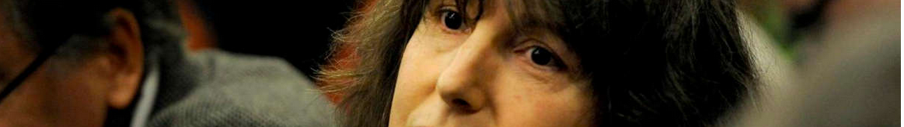

# À propos

## Récit

J'avais été un agent de l'administration centrale du Quai d'Orsay pendant 8 ans,
quand j'ai [été nommée au mérite, à un poste à l'ambassade de France au Bénin](./promed.md#RAINERI-RAUGEL),
à une époque où  [Hervé BESANCENOT](./whoswho#besanc) était à sa tête.
J'ai soulevé des doutes sur la comptabilité de l'attribution des bourses sous ma responsabilité, qui m'ont valu des pressions.

Les termes du procureur dans ma [constitution de partie civile de 2015](./aplogan.md),
pour qualifier l'agression de 2010 commise par mon collègue de bureau,
sont « tentative d'homicide. » Le jugement s'appuie sur un certificat médical de SSPT consécutif à cette attaque;
elle, a conservé son emploi à l'ambassade compte tenu de son lien avec l'établissement du pays d'accueil.
Ce procès a été marqué par des incohérences conformes [à des moeurs documentés](./denijust.md#jl2014).
L'appel est en attente.

Rapatrié contre mon gré, j'ai été placardisée,
ce qui a déclenché une [cascade de crises de santé](./promed.md#a999fcb2).
En 2018, [j'ai été radiée](.radiation.md). En parallèle,
le MAE a systématiquement rejeté mes demandes initiées en 2013,
de [protection fonctionnelle](./pf.md),
un statut réservé aux fonctionnaires menacés. C'était alors [Nathalie LOISEAU](./whoswho#loiseau), la responsable des ressources humaines.
Une longue bataille juridique a suivi, se soldant en 2021 par un jugement qui m'était favorable, sur cet aspect particulier.

En 2019, le journal Libération a publié un [décodage de mon affaire](./demarches/medias.md#pezetnicolas),
relevant que «aucune décision de justice la qualifiera de victime puisque chaque femme accuse l'autre d'être à l'origine de l'agression... »
Ma réfufation a [enregistré 700k vues](https://twitter.com/FranoiseNicolas/status/1115997608533737475?s=20&t=xx9LpTCg5ZYSiw98wwIkgA). 

## Lanceur d'alerte

La protection des lanceurs d'alerte a été un sujet législatif actif dans l'UE/en France ces dernières années.
J'ai [signalé à plusieurs parties](./influence.md) que le [Défenseur des Droits](https://twitter.com/Defenseurdroits) avait systématiquement blanchi le MAE
dans le cadre de 5 requêtes initiées en 2012.
Le nouveau projet de loi de transposition du droit européen, 
porté par [Sylvain WASERMAN](https://twitter.com/SylvainWaserman), 
lui confère des pouvoirs renforcés. 
En 2020, le même quotidien que j'ai cité [a salué le défenseur des droits](./whoswho.md#touboninesp).

La [corruption](./corruption.md) est un genre littéraire à part-entière. Sauf quelques notables exceptions, il y a un angle mort sur ses ressorts: [les tribunaux](./robenoire.md). Dans ce domaine, ce wiki se penche sur l'[affaire Elf](./elf.md) qui a fait de [Eva Joly](https://twitter.com/EvaJoly) une icône,  et [celle du Carlton](./carlton.md). Pour ceux qui ne savent pas quoi penser, le sort de Sarkozy après l'élection présidentielle devrait les aider. 

Ce wiki s'intéresse aussi à la [l'état policier](./etatpolicier.md), aux [dénis de justice](vp/denijust.md) envers les gens comme vous et moi, et la [capture de l'état](./capturetat.md) derrière les plus grandes fortunes de France.

Les bonnets rouges (2014), les gilets jaunes (2018-2019), et les zadistes (1968-2018),
ont pour point commun [l'occupation, et la capitulation de l'état](./democralter.md#lecoq2018projets).
Cependant, cela ne perturbe nullement la tromperie de la classe dirigeante à l'endroit du plus grand nombre. 
Face à sa capacité de récupération de crise, la [démocratie alternative](./democralter.md) a déjà un air galvaudé.
Reste la voie retenue par ce wiki: [sortir de sa position de pigeon](./robenoire.md#carage2015demontg).
 
## Autre
Je suis originaire de Saint-Malo, et mère célibataire d'un enfant unique depuis l'âge adulte.  En [1986](../pieces/identifiant/829cbd9) et [1987](../pieces/identifiant/b5b09b6e) j'ai été récompensée par les Fondation de la Vocation et de l'Espace, respectivement, pour mon travail de thèse sur le droit de l'espace. En 2017, j'étais [candidate suppléante](http://www.nantes-infos.fr/legislatives-1ere-circonscription-de-la-loire-atlantique-christophe-le-tallec-et-francoise-nicolas-candidats-de-la-france-insoumise-3-5-137.html) pour représenter la 1ère circonscription de Loire-Atlantique à l'Assemblée nationale, aux couleurs de [France Insoumise](https://twitter.com/FranceInsoumise).

---
Photo: [Françoise Nicolas, rencontre LDA, 2015](attrib#marc-chaumeil)
