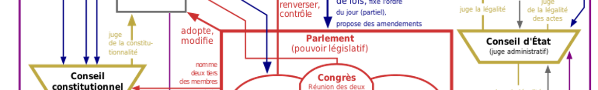

# [Affaire Françoise NICOLAS](fn.md) — Institutions

Actions de Françoise NICOLAS auprès d'institutions en faveur de l'état de droit.

## France
* [Assemblée Nationale](parl.md#fn)
* [Défenseur des droits](ddd.md)
* [Service Central de Prévention de la Corruption](scpc.md)
## [Union Européenne](ue.md)
## [États-Unis d'Amérique](statedrl.md)

---
[Photo](attrib.md#Ver)
