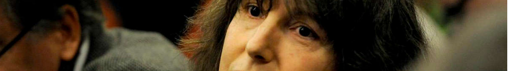

# About

## My story

I had been an agent of the central administration of the Quai d'Orsay for 8 years,
when I [was appointed on merit, to a position at the French Embassy in Western Africa](./nicolas-faits.md#RAINERI-RAUGEL),
at a time when Hervé BESANCENOT was at its head.
I raised doubts about the accounting for the allocation of scholarships under my responsibility, which earned me pressure.

The words of the prosecutor in my [2015 adhesion criminal proceeding](./nicolas-aplogan.md),
to qualify the attack of 2010 committed by my office colleague,
are "attempted homicide." The judgment mentions a medical certificate of PTSD following this attack;
she kept her job at the embassy in regards to her strong connections in the host country.
This trial was marked by anomalies [whose systemic character are well documented](./bib-gen.md#jl2014).
The appeal is on hold.

Repatriated against my will, I was professionally sidelined,
which triggered a [cascade of health crises](./nicolas-faits.md#a999fcb2).
In 2018, [I was terminated](./deregistration.md). In parallel,
the MAE has systematically rejected my requests initiated in 2013,
to be granted statutory protection](./nicolas-pf.md). The head of human resources was then [Nathalie LOISEAU.
A grueling legal battle followed, ending in 2021 with a judgment in my favor on this particular aspect.

In 2019, the newspaper founded by Jean-Paul Sartre, Liberation, published a [fact check of my affair](./nicolas-medias.md#pezetnicolas),
stating that "no court decision will qualify her as a victim since each woman accuses the other of being at the origin of the aggression..."
My refutation has [registered 700k views](https://twitter.com/FranoiseNicolas/status/1115997608533737475?s=20&t=xx9LpTCg5ZYSiw98wwIkgA).

## Whistleblower

Whistleblower protection has been an active legislative topic in the EU/France in recent years.
I [reported to several parties](./activ.md#nicolas), that the ombudsman had systematically whitewashed the MFA in the [context of 5 requests](./nicolas-lda.md) initiated in 2012.
The new bill transposing European law,
sponsored by Sylvain WASERMAN,
gives that entity enhanced powers.
    In 2020, the same daily that I quoted hailed its outgoing prsident, Jacques TOUBON, [“a serendipitous ombudsman”](./bib-gen.md#inespere).

Corruption is a literary genre in its own right. With a few notable exceptions, it has a blind spot: [rigged courts](./nicolas-japp.md). In this area, this wiki focuses on the Elf affair that made Eva JOLY famous and the conveniently sleazy Carlton affair implicating the ex-IMF chief.
 
## Other
I am from Saint-Malo where ["A Summer's Tale"](https://www.imdb.com/title/tt0115940/) was filmed, and a single mother of an only child since adulthood. In [1986](../pieces/identifiant/829cbd9) and [1987](../pieces/identifiant/b5b09b6e) I was awarded prestigious prizes for my thesis work on space law. In 2017, 
I was [substitute candidate](http://www.nantes-infos.fr/legislatives-1ere-circonscription-de-la-loire-atlantique-christophe-le-tallec-et-francoise-nicolas-candidats -de-la-france-insoumise-3-5-137.html) to represent a constituency of Nantes in the National Assembly, on a [France Insoumise](https://twitter.com/FranceInsoumise) platform.

### Also see
* [Synopsis of pages on me](./whoswho.md#nicolas)

---
[Photo](./cewiki-attrib.md#marc-chaumeil)
