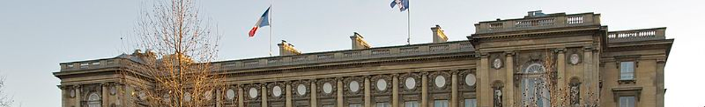

# [Françoise NICOLAS](fn.md) — Dossier administratif

## 🗓️

* [2009-12-01 — Mise en demeure](../pieces/identifiant/a9f17cba)
<!--
* [2010-03-10 — Avocat — Notification de délai](../pieces/identifiant/a9f17cba)
-->

### TA de Paris no. 1006079/5-2

Info

* Demandeur: Françoise NICOLAS
* Défendeur: MAE
* Objet: 
    1. Retrait du dossier administratif de document émis par
        - l'inspection, non signé, du [2009-08-05](nicolas-faits.md#inspec)
        - Hervé BESANCENOT
        - Hervé BESANCENOT
    2. Refus de communication de son dossier médical

* [2010-03-31 Saisine](../pieces/identifiant/4e3f1aaf)

* [2011-12-🚧 — Mémoire de défense](../pieces/identifiant/1dae248)

* [2012-02-🚧 — Mémoire en réplique](../pieces/identifiant/4e3f1aaf)

* 2012-02-16 Audience publique

* [2012-03-08 — Décision](../pieces/identifiant/6869eeaf)
<!-- 36-07-01-01 -->

Extrait

* Sur les conclusions aux find d'annulation:

Considération, en premier lieu, que Mme NICOLAS soutient que son dossier administratif contenait notamment des pièces relatives à sont état de santé alors que ces pièces, étant couvertes par le secret médical, auraient dû être retirée de son dossier; que, toutefois, les documents en cause, à savoir deux télégramme diplomatique rédigés par l'ambassadeur de France au Bénin, en date du 2008-11-10 et 2008-11-21, ainsi que l'extrait d'une note, établie par l'inspection générale des affaires étrangère, en date du 2009-08-05, se bornent à constater les difficultés d'adaptation de Mme NICOLAS [], afin d'envisager, dans l'intérêt du service et de l'intéressée, l'évolution de sa situation professionnele; que, dès lors, et nonobstant la circonstance qu'un des documents mentionne la spécialité médicale à laquelle il a été fait recours, ces documents ne sauraient être regardé comme portant atteinte au secret médical, ni au respect de la vie privée de Mme NICOLAS;

Considérant, en second lieu, que Mme NICOLAS soutient que les documents susmentionnés contiendraient des informations erronnées et mensongères; que, toutefois, le caractère matériellement inexact des information contenues dans les documents incriminés; que la circonstance, à la supposer établie, que ces documents seraient susceptibles d'avoir un effet négatif sur le déroulement de la carrière de Mme NICOLAS ou lui causeraient un préjudice moral est sans influence sur la légalité de la décision attaquée;

[...]

DÉCIDE

Article 1er: requête rejetée

### Pourvoi no. 359289

* [2012-05-11 Pourvoi](../pieces/identifiant/652eb16d)

* [2012-09-17 Mémoire complémentaire](../pieces/identifiant/5579e302)

* [2013-02-15 Décision](../pieces/identifiant/fde986c)

---
[Photo](./cewiki-attrib.md#HotelMAE.md)
