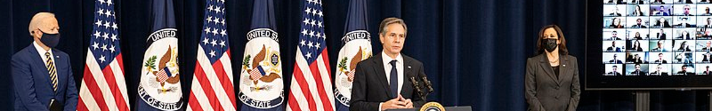

# Département d’état

## Contexte

Le département d’état des É.U. a un bureau dédié à la démocratie, aux droits humains, et aux travailleurs ([State DRL](https://twitter.com/stateDRL)), qui publie statutairement chaque année un rapport mondial. Pour la France en [2020](https://www.state.gov/wp-content/uploads/2021/03/FRANCE-2020-HUMAN-RIGHTS-REPORT.pdf) et [2021](https://fr.usembassy.gov/wp-content/uploads/sites/50/313615_FRANCE-2021-HUMAN-RIGHTS-REPORT.pdf): « l'impunité n'était pas répandue » ("impunity was not widespread"). 

## 📁
### Françoise NICOLAS

Signalement à leur directeur, Lisa PETERSON, à l'ambassadeur, Denise CAMPBELL-BAUER, et à des tiers tels que le correspondant à Paris du NYTimes, Roger COHEN et le directeur de Human Rights Watch à Paris, Kenneth ROTH.

* 2022-02-01

    

      
Info

    
    * [Amb EU - lettre](../pieces/identifiant/67ecf1b9)
    * [Amb EU - dépôt](../pieces/identifiant/6ee9b5eb)
    * [Dép. d'état - lettre](../pieces/identifiant/31f73b4d)
    * [Dép. d'état - dépôt](../pieces/identifiant/8fefd21f)
    

    
    

      
🇬🇧Lettre

    
    > 02/01/2022
    > 
    > The Honorable Lisa Peterson\
    > Bureau of Democracy, Human Rights and Labor\
    > U.S. Department of State\
    > 2201 C St. NW\
    > Washington, DC 20520\
    > 
    > FRANCE: persecution of a female diplomat for reporting corruption
    > 
    > Dear Assistant Secretary Peterson,
    > 
    > On 03/30/2021, you presented the 45th Country Reports on Human Rights Practices, 
    > stressing fact checking as its basis, and encouraging disreputable governments to change course as its purpose. 
    > I bring to your attention the following allegation: as a former diplomat with 8 years of service, 
    > the French state has been persecuting me for a decade, resulting in ruin in all aspects of my life, 
    > for having disrupted misappropriation of taxpayer’s money at an embassy in Western Africa.
    > The high point of my activism is getting an audience with the member of parliament overseeing whistleblowers, 
    > a hot legislative topic. Substantiation in the  attached report.
    > 
    > Sincerely,
    > 
    > 
    > Françoise Nicolas.
    > 
    > CC: Paris Bureau Chief, New York Times, Roger Cohen; 
    > Co-chair, Tom Lantos Human Rights Commission, Hon. James P. McGovern; 
    > Executive Director, Amnesty International USA, Paul O’Brien; 
    > Executive Director, Human Rights Watch, Paris branch, Kenneth Roth; 
    > Co-chair, Tom Lantos Human Rights Commission, Hon. Christopher H. Smith.
    

    

      
🇬🇧Mémoir

    
    > 1 Authorship
    > 
    > I am Françoise Nicolas, born in 1961 in Saint-Malo, France, ex-diplomat turned whistleblower, residing in Nantes. 
    > An anonymous party helped redact this document.
    > However, I am solely responsible for it.
    > 
    > 2 Facts
    > 
    > On the state of the rule of law: in 2014, a parliamentarian commissioned a report titled “Citizens and the judiciary”. 
    > It says: “there is a stranglehold on the judicial arsenal by some agents, that hijack the rules to profit one party at the expense of the other, bogging the latter in costly and endless proceedings.”[2, p. 5] 1 . 
    > The same year public television released a documentary on the topic: “the ministry of justice is working on reform of judicial agents’ accountability, 
    > the fourth report in 5 years”[1]. 
    > The ‘Conseil d’État’ is the public law court of last resort. According to a law scholar, it is in the context of public works, “an instrument of legitimation of
    > the ruling class”[3, p. 139]. At the conclusion of an inquiry commission on the state of justice, in 2020, its president filed a penal complaint against the prefect of Paris, the president of the appelate court of Paris, the prosecutor of Paris, and the former prosecutor of the financial crime unit, for making false testimonies[9].
    > 
    > My story begins in 2008, with a diplomatic cable announcing my posting in Western Africa, praising my professional abilities and commitment. 
    > This assesment was reiterated in my 2009 professional evaluation (available upon request). Having responsibility for the management of grants, 
    > I reported anomalies in their accounting, first to the embassador (via a collaborator), Hervé Besancenot, then up the chain of command. 
    > Character assasination, and other forms of harassment, followed. 
    > My office-mate was an exceptionally well connected native of the host country. 
    > We used to get along, but she showed animosity towards me, culminating in a physical attack (strangulation) on 01/14/2010. 
    > A low level employee, followed by a security officer, rescued me. 
    > My repatriation was decided, officially to protect me, and because “my superiors lost faith in me”. 
    > Back in France, I was shunned aside professionally (“placardisé”). 
    > In 2018, I was removed from the civil service force. This happened under the auspices of Nathalie Loiseau as HR director, 
    > later to become Minister of European Affairs and MEP. 
    > In 2021, the person who was deputy director for Western African affairs in 2010, publicly deplored the state’s vendetta against me[8] 2 .
    > 
    > In 2013, I filed with the Ministry of Foreign Affairs to be granted a particular
    > status reserved to civil servants when they come under attack—“protection fonction-
    > nelle”. They rejected it on the grounds that it would jeopardise diplomatic relations
    > with the Western African country in question. By ruling n o 16NT01873 of 2018, the
    > appelate court of Nantes ordered the MFA to reconsider its position. Under the pen
    > of Jean-François Casabonne Masonnave, it reiterated its refusal, arguing that the
    > threat was history. That’s a half truth: the status would have come with substantial
    > retroactive benefits, such as the reimbursment of legal fees. In principle, closure
    > to this saga came through ruling n o 1805251 of 2021 by the lower court of Nantes,
    > vindicating me. In pratice, it’s a different story 3 . In parallel, I pursued all the way
    > to the Conseil d’État, an action to overturn my unfair termination, in vain.
    > 
    > In 2015, I filed a criminal lawsuit through an adhesion procedure. Article 80 of
    > the code of penal procedure provides that the investigative magistrate is bound by
    > the prosecutor’s indictment, in my case “attempt at homicide”. The ruling came in
    > 2020, citing a psychiatric evaluation dated 07/16/2012 linking PTSD to that event. It
    > dimissed the case (“non-lieu”) in the absence of sufficient evidence, for which consular
    > services were relied upon for witnesses. There is an obvious conflict of interest about
    > them, and neither my supervisor, nor the ambassador were auditioned. Stated in
    > the ruling: my lawyer failed to respond in time to the court’s demand, to send them
    > the documents from the public law proceedings. Should that have been calculated
    > negligence, it would fit a pattern described in the aforementioned 2014 report (court
    > auxiliaries are critical players in perverting the course of justice) 4 . I appealed on
    > 03/09/2020, it’s pending.
    > 
    > Article 4 of “loi organique du 29 mars 2011” provides that the ombudsman (“Défenseur
    > des Droits”) shall “defend the rights and freedoms of citizens in their dealings with
    > the state” (fighting discimination). Starting in 2012, and spanning three presiden-
    > cies, they have systematically whitewashed the MFA in the context of my requests
    > with them—a total of 5, which fits a documented pattern[2, p. 5, 34]. EU Direc-
    > tive 2019/1937 provides for whistleblower protection that already existed in France
    > under law Sapin 2. Sylvain Waserman is the sponsor of bill n o 4398 of the National
    > Assembly, transposing this directive, and well aware of my case 5 . It grants extended
    > powers to the ombudsman. On 12/03/2021, 
    > I notified the EU-Whistleblowers unit under Justice commissioner Didier Reynders, of my disillusion with this entity.
    > 
    > In 2019, an influential newspaper, Libération, published a fact-check of my story[5].
    > Here again, half truths. The article begins by saying the attacker and me are on an
    > equal footing, since our accusations mirror each other’s and no ruling vindicated
    > either. That’s to omit MFA put forth reason of state, literally, for denying me “pro-
    > tection fonctionelle”, and to pretend the odds of PTSD afflicting the victim or the
    > perpretator were 50/50. More debunking is provided online[4] 6 . In 2020, the same
    > journal titled: “outgoing ombudsman beats all expectations”[7]. The same year I gave
    > a testimony before the then parliamentarian in charge of whistleblowers, pointing to
    > specific instances of nepositism behind their obstruction towards me[6].
    > 
    > I have made a drastic selection in the attached documents. Should any claim that
    > I have made call for the production of a document, I’m happy to oblige.
    > 
    > 3
    > Bibliograhy
    > [1] Le juge se masturbe en pleine audience–France 2. French. 2014. 
    > [2] Nadya Saidi and Antoine Fontaine. Les justiciables face au service public de la
    > justice; états des lieux, diagnostic des dysfonctionnements. French. Jean Lassalle,
    > 2014.
    > [3] Vincent Le Coq. Projets publics, intérêts privés: Une mobilisation citoyenne pour
    > refuser l’arbitraire. French. Libre solidaire, 2018.
    > [4] @FranoiseNicolas. French. Comme je l’ai dit hier, l’article de Libération n’est
    > pas exact. Apr. 2019. 
    > [5] Jacques Pezet. “CheckNews: De quoi Françoise Nicolas, ex-fonctionnaire aux
    > Affaires étrangères, accuse-t-elle Nathalie Loiseau ?” French. In: Libération (Apr.
    > 2019).
    > [6] Ugo Bernalicis. Audition φ - Lanceurs d’alerte dans la fonction publique. French.
    > 2020. 
    > [7] Sylvain Mouillard and Philippine Kauffmann. “Jacques Toubon : fin de mandat
    > d’un Défenseur inespéré”. French. In: Libération (June 2020).
    > 
    > [8] @laurentbigfr. French. j’étais sous-directeur au Quai d’Orsay au moment des
    > faits. Je ne comprends pas . . . Mar. 2021. 
    > Q.
    > [9] Pierre Bienvault. “Des magistrats et un préfet de police accusés de “faux té-
    > moignages””. French. In: La Croix (Jan. 2021).
    > 
    > 4
    > Attached
    > 1. Identification . . . . . . . . . . . . . . . . . . . . . . . .\
    > Ministry of Foreign Affairs . . . . . . . . . . . . . . .
    > 2. Diplomatic cable dated 01/11/2008 (overseas posting) .
    > 3. Diplomatic cable dated 02/03/2010 (repatriation) . . .\
    > Criminal proceeding . . . . . . . . . . . . . . . . . . .
    > 4. Ruling dated 02/28/2020 . . . . . . . . . . . . . . . . .\
    > “Protection fonctionelle” . . . . . . . . . . . . . . . .
    > 5. Ruling n o 1805251 dated 10/26/2021 . . . . . . . . . . .\
    > Ombudsman . . . . . . . . . . . . . . . . . . . . . . . .
    > 6. Follow up to a new demand for whistleblower status, on 08/11/2021
    

* 2022-05-20
    

      
Info

    
    * [Amb EU - lettre](../pieces/identifiant/6ed4b67c)
    * [Amb EU - dépôt](../pieces/identifiant/3d2125d8)
    * [Dép. d'état - lettre](../pieces/identifiant/d7c8696b)
    * [Dép. d'état - P.J. no. 1](../pieces/identifiant/bf8eea58)
    

    

      
🇬🇧Lettre

    
    04/15/2022
    
    The Honorable Lisa Peterson\
    Bureau of Democracy, Human Rights and Labor\
    U.S. Department of State\
    2201 C St. NW\
    Washington, DC 20520
    
    FRANCE: persecution of a female diplomat for reporting corruption
    
    Dear Assistant Secretary Peterson,
    
    On 07/08/2021 you echoed Abraham Lincoln’s warning that “citizens may lose
    trust in democracy”. Here’s an update to my 02/01/2022 letter on the stated
    subject, received the 14th.
    
    The attached memoir ended on this note: “I have made a drastic selection in
    the attached documents. Should any claim that I have made. . . ” Recently I set up
    github.com/francoise-nicolas/Wiki, that keeps track of my legal & advocacy
    work, with supporting evidence (work in progress).
    
    On the open reason of state and the penal ruling in my case, I said: “and neither
    my supervisor, nor the ambassador were auditioned”. This begs for an erratum :
    these parties made statements before the prosecutor (see attachment no. 4 of the
    memoir), but there was no confrontation (in the sense of the 6th amendment) in
    the adhesion procedure I filed for to overrule his dismissal.
    
    Your bureau’s 2021 report on France reiterates from 2020, “impunity was not
    widespread” 3 . Attached, a [draft op-ed](../pieces/identifiant/bf8eea58) that continues the part of my memoir on
    the rule of law (it’s dated 04/24/2022, I see no major change in hindsight).
    
    Sincerely,
    
    
    Françoise Nicolas.
    
    CC: Paris Bureau Chief, New York Times, Roger Cohen; Co-chair, Tom Lantos Human Rights Commission, Hon. James P. McGovern; Executive Director, Amnesty International USA, Paul O’Brien; Executive Director, Human Rights Watch, Paris branch, Kenneth Roth; Co-chair, Tom Lantos Human Rights Commission, Hon. Christopher H. Smith.

    Attached:
    1. Op-ed proposal dated 04/21/2022 . . . . . . . . . . . . . . . . . . . . . .

    

---
[Photo](./cewiki-attrib.md#blinken)
