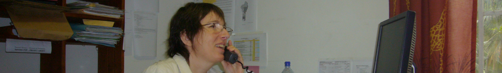

<!---->

# [Françoise NICOLAS](fn.md) — Faits

Chronologie des faits de carrière au Ministère des Affaires Étrangères donnant lieu à [litiges](litiges.md). 

<!--

## Organismes et personnes

Les personnes clés ou à haute responsabilité sont signalées par †.

  
MAE

- ADISSIN
- BAHUHAUD
- BESANCENOT†
- BENICHOU
- HEUDE
- HEURTAUX
- LEROY
- RAINERI

  
Juriste

- ASSOULINE

  
Médical

* CHU Nantes
    - BARBIER (Dr.)
    - DE FAUCAL (Dr.)
    - LAMBERT (Dr.)
* Autre
   - APITHY (Dr.)
   - LOPEZ (Dr.)†
   - NORTIER (Dr.)†

  
Syndical

* CFTC

-->

## 🗓️
* 2001-09-19 — [Rapport sur NICOLAS](../pieces/identifiant/8ce4e41b)
    
    

      
Extrait

    
    * A pris ses fonctions le 2000-11-15
    * Affectée au bureau des affaires juridiques comme rédacteur
    * Vite intégrée au groupe
    * Sérieuse, toujours disponible
    * Exécute sans difficulté les missions
    * Avis favorable à sa titularisation
    

* 2008-01-11 — [Passation de Christian R.](../pieces/identifiant/82f04043)
    
    

      
Extrait

    
    * Candidatures suivantes ont été enregistrées sur la relève de M. RAUGEL, chargé de mission au SCAC à votre poste: ...
    * Le département a retenu la candidatuer de Mme NICOLAS
    * Diplômée de l'IEP, DEA, Secrétaire de Chancellerie
    * Ses évaluateurs mettent en avant ses qualités intellectuelles, sa grande culture personnelle, sa conscience professionnelle, et sa loyauté
    * L'intéressée suivra le stage des nouveaux partants
    * Tuilage de Cotonou de quelques jours
    

* 2008-03-21 — [Passation de Christian R.](../pieces/identifiant/70648ad4)

* 2008-11-10 — [Situation de NICOLAS](../pieces/identifiant/8f49a7c9)
    
    

      
Extrait

    
    Depuis son arrivée en poste en juillet dernier, sérieux problèmes d'adaptation aux condition de vie [...] demeure préocuppé par sa fragilité psychologique.
    

* 2008-11-21 — [Situation de NICOLAS](../pieces/identifiant/69a4a2bb)
    
    

      
Extrait

    
    La situation est la suivante:
    * État psychologique s'est amélioré avec l'arrivée de son compagnon et visite chez un psychologue
    * Le SCAC a sensibilisé son compagnon, celui a indiqué qu'il serait vigilant
    * Actuellement en congés, au retour échange avec le psychologue du département souhaitable 
    

* 2009-01-28 — NICOLAS — [Base de donnée](../pieces/identifiant/21b63641)

* 2009-01-28 — NICOLAS — [Base de donnée](../pieces/identifiant/25390630)

* 2009-05-13 — [Évaluation](../pieces/identifiant/3cd189d9)
    
    

Extrait

    
    Je marque ma satisfaction sur la manière de servir, dont le travail permet depuis a prise de fonction de moderniser les outils de gestion pour faire des bourses, missions et invitation un instrument performant au service de notre politique culturelle et notre influence.
    

* 2009-06-17 — Certificat médical
    

      
Info

    
    * Établissement: CMC Ste Anne d'Afrique
    * [dossier](../pieces/identifiant/689d32ae)
    

* 2009-01-28 — NICOLAS — [Arrêt de travail](../pieces/identifiant/1dd49b9d)

* 2009-07-06 — NICOLAS — [Rapatriement sanitaire](../pieces/identifiant/605abc17)

* 2009-07-28 — NICOLAS — [Prolongation arrêt de travail](../pieces/identifiant/13557c40)

* 2009-08-07 — MAE — [Confidentiel](../pieces/identifiant/972312c1)

*  2009-08-09 — MAE  — [Confidentiel](../pieces/identifiant/972312c1)

* 2009-09-01 — RAINERI — [Retour au poste](../pieces/identifiant/53ab57b6)

* 2009-09-15 — BESANCENOT — [Retour au poste](../pieces/identifiant/6cccb7cc)

* 2009-09-15 — NICOLAS — [Dossiers fantômes](../pieces/identifiant/55ba3b60)

* 2009-09-16 — NICOLAS — [Dossiers fantômes](../pieces/identifiant/1cdc18bb.pdf)

* 2009-11-11 — LEROY — [Mise au point](../pieces/identifiant/4b91bbe0)
    
    

      
Extrait

      
    Vos propos en date du 2009-09-24 ne donnent pas une image fidèle de nos entretiens du 2009-09-23. Vous m'avez expliqué que c'est M. Alain RICHARD, conseiller de coopération, qui vous avait demandé de venir [à la cérémonie... Lui] m'a affirmé ne jamais vous l'avoir demandé. 
    

* 2009-10-18 — NICOLAS — [Intimidations](../pieces/identifiant/9925f080)

* 2009-12-02 — NICOLAS — [Dossiers fantômes](../pieces/identifiant/59dd3ab2)

* 2009-12-14 — NICOLAS — [Dossiers fantômes](../pieces/identifiant/ef3c4d08)

* 2010-01-08 — NICOLAS — [Dossiers fantômes](../pieces/identifiant/b3857442)

* 2010-01-05 — Certificat médical — Aphone

* 2010-01-13 — NICOLAS — [« Suis aphone »](../pieces/identifiant/241a304f)

* 2010-01-13 — NICOLAS — [Dossiers fantômes](../pieces/identifiant/241a304f)

* 2010-01-14 — Certificat médical — Coups et blessures

* <a id="certifbless"><a>2010-01-21 — [Certificat médical — Coups et blessures](../pieces/identifiant/241a304f)

* <a id="rappel"><a>2010-01-22 — [BESANCENOT — Rappel de NICOLAS](../pieces/identifiant/29a57487)
     

     
     
Extrait

       
     Le 14 janvier dernier, grave incident ayant opposé deux agents [...] Raisons qui ont conduit à son rappel:
     * Prévenir décision d'expulsion et exploitation médiatique
     * Garantir un fonctionnement normal du poste
     * Tirer les conséquences d'une perte de confiance de sa hiérarchie à l'égarde l'intéressée
     

* 2010-02-03 — [CAP / MAE — Mutation](../pieces/identifiant/5b32727a)

* 2010-02-11 — [DRH — Entretien](../pieces/identifiant/408585c9)

* 2010-04-08 — [DRH — Imputabilité](../pieces/identifiant/9c685774)

* 2010-05-12 — [CAP / MAE — Mutation](../pieces/identifiant/5b32727a)

* 2010-06-01 — [BESANCENOT — Rupture d'établissement](../pieces/identifiant/f9552637)

* 2010-06-21 — [MAE — Mutation](../pieces/identifiant/e3b1c092)

* 2010-07-15 — Congé maladie — Entrée

* 2010-08-31 — Congé maladie — Sortie

* 2010-10-11 — [NICOLAS — Recours indemnitaire](../pieces/identifiant/3ffead3a)

* 2010-12-15 — MAE — Rejet implicite

* 2010-10-27 — [Certificat d'hospitalisation](../pieces/identifiant/e3620bce)

* <a id="salaire"><a>2011-03-29 — [MAE — Expertise médical](../pieces/identifiant/642c74e1)

* 2011-04-12 — [Expertise médicale](../pieces/identifiant/b4e79693)
    
    

      
Extrait

      
    * 2 arrêts de travail liés de manière directe et certaine à l'accident du \DTMdate{2010-01-14}
    * Séquelle psychologique mineure sans nécessité de psychotrope mais psychothérapie jusqu'au mois de mai 2011
    * Pas d'état pathologique antérieur
    * Pas d'incapacité permanente partielle liée à l'accident
    * Pas de consolidation des troubles psychiques au \DTMdate{2010-07-14}
    

* 2011-04-19 — MAE — Imputabilité

* <a id="indemnite"><a>2011-06-01 — [DGAM — Indemnite](../pieces/identifiant/35d3dae9)

* 2012-02-07 — [Attestation de témoin](../pieces/identifiant/6f18410d)
    
    

Extrait

    
    
    * Dément formellement avoir été sensibilisé sur l'apparente fragilité de NICOLAS
    

* 2012-02-10 — [DRH — Imputabilité](../pieces/identifiant/9fb9b2c8)

* 2013-03-06 — [CFTC — Statut de victime](../pieces/identifiant/7caecbb5)

* 2015-12-09 — Congé maladie (début)
<!-- Motif: raptus suicidaire -->

* 2016-11-02 — [Certificat médical](../pieces/identifiant/a999fcb2)
    
    

      
Extrait

      
    > État de santé consécutif à la rechute de son accident de service de 2010-01-14 non consolidé
    > Hospitalisation au CHU de Nantes du 2016-04-15 imputable à l'accident de service précité
    > Inapte à reprendre le travail
    > Nécessaire de changer d'administration
    

* 2017-03-29 — [Certificat médical](../pieces/identifiant/aab4aae)

* 2017-10-04 — Certificat médical

* 2017-11-20 — NICOLAS — Congé longue durée

* 2017-11-20 — Certificat médical

    

      
Extrait

      
    * « stress d'origine professionnelle dû à une mutation à Nantes, à une fonction qui lui déplait »
    

* 2018-01-30 — Commission de réforme — IPP à 20%

* 2018-04-06 — [NICOLAS — Radiation](../pieces/identifiant/e122f48d)

    

Extrait

    
    Par lettre du 08 février 2018, vous avez indiqué à Mme NICOLAS que vous entendiez suivre l'avis émis par la commission de réforme le 30 janvier 2018, lui refusant une contre-expertise suite à l'examen effectué par le Dr. NORTIER.
    
    Ma mandante conteste cette décision...
    

* 2018-06-01 — Congé maladie (fin)

* 2018-04-11 — [DMAT — Protection fonctionnelle](../pieces/identifiant/5884d9d2)

    

      
Extrait

      
    En exécution de cet arrêt (2018-01-11), [...] le Département a considéré que huits ans après les faits survenus au Bénin qui ont motivé votre demande, vous n'étiez exposée à aucune menace ou risque de préjudice à raison de vos fonctions.
    

* 2018-07-25 — [Radiation](../pieces/identifiant/87f8abb5)

* 2021-01-29 — [Certificat médical](../pieces/identifiant/69d142)

    

      
Extrait

      
    Le score de 63 obtenu par Mme Nicolas sur l'échelle PCL 5 indique clairement et de façon indiscutable que Mme Nicolas présente un trouble psychotraumatique très sévère en rapport direct et certain avec l'agression subie le 14 janvier 2010.
    Néanmoins, comme l'écrivent la plupart des psychiatres (à l'exception du Dr Nortier), elle est apte à reprendre son poste, et ce d'autant plus qu'elle pourrait bénéficier d'une thérapie brève, spécialisée, qui devrait améliorer son trouble psychotraumatique
    

---
<!--[Photo](./cewiki-attrib.md#asonposte)-->
[Photo](./cewiki-attrib.md#scac)
