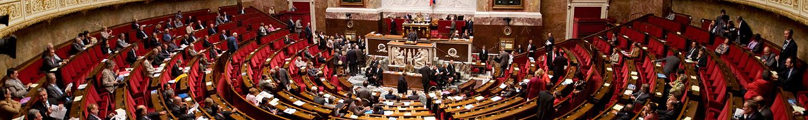

# Prolifération législative

## Rapport
### 2000 [Conseil d'État: le droit souple](https://www.ladocumentationfrancaise.fr/var/storage/rapports-publics/144000280.pdf)

## Autre
### 2007 [Robert Badinter : "Ne pas confondre justice et thérapie"](https://www.lemonde.fr/societe/article/2007/09/08/robert-badinter-ne-pas-confondre-justice-et-therapie_952825_3224.html)

> La multiplication des lois, sans chercher à s'assurer de leur efficacité, engendre un désordre législatif préjudiciable. 

### 2014 Sur Médiapart: [Réformer une justice malade (2/3). La grande misère de la justice](https://www.dailymotion.com/video/x2spq5t)

> Seules 200 des 15000 infractions sont effectivement utilisés (Yves Charpenel au temps 18:20)

---
Photo: [Hemicycle de l'AN](https://fr.wikipedia.org/wiki/Assemblée_nationale_(France)#/media/Fichier:Panorama_de_l'hémicyle_de_l'assemblée_nationale.jpg)
