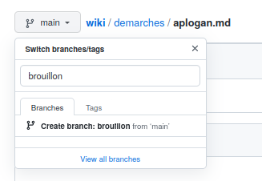

# Technique

## Maintenance
- [_pieces](#_pieces)
- [pieces_](#pieces_)

## Travaux encours

## Idées
- Boutons de navigation dans les pages
- Statistiques de trafic (Google analytics?)
- [Site web à part entière](https://jekyllrb.com/)

## Aide mémoire

### github

Pour les modifications d'un fichier, privilégier une branche dédiée, 
et seulement lorsqu'il est prêt, un 'pull request'.

